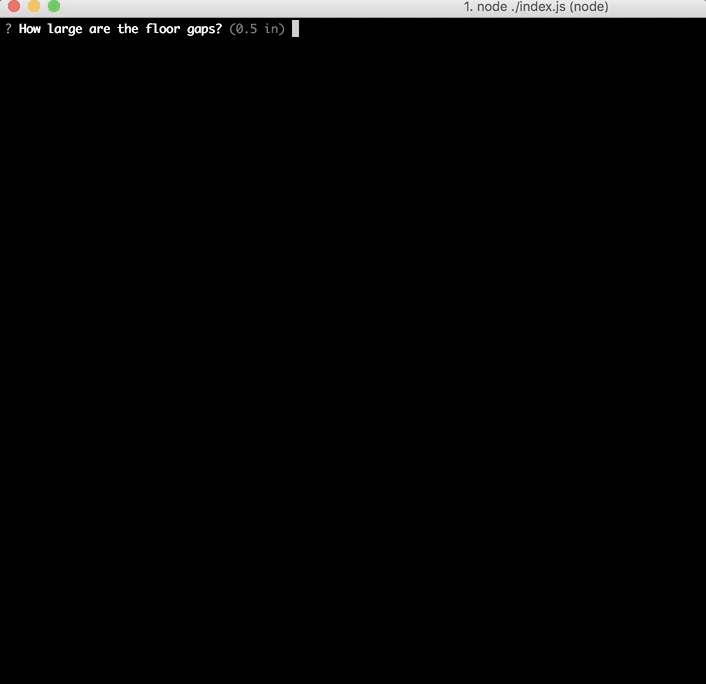

# Flooring CLI

Little CLI to help figure out the proper flooring layout given dimensions

<!-- AUTO-GENERATED-CONTENT:START (TOC) -->
- [Using](#using)
- [Developing](#developing)
- [Engines](#engines)
<!-- AUTO-GENERATED-CONTENT:END -->

## Using

Install the module globally to expose the `flooring` command.

<!-- AUTO-GENERATED-CONTENT:START (INSTALLCMD:flags=["-g"]) -->
```sh
npm install -g flooring-cli
```
<!-- AUTO-GENERATED-CONTENT:END -->

From the terminal, run:

```sh
flooring
```

From there, it will walk you through calculating how to setup your flooring.




## Developing
1. **Initial Setup** - make sure to have proper engines installed
2. **Clone the project**. `git clone git@github.com:camacho/flooring.git`.
3. **Install dependencies**. `yarn`
4. **Run the app**. `yarn dev`

## Engines
<!-- AUTO-GENERATED-CONTENT:START (ENGINES) -->
* **yarn**: >=0.24.5
* **node**: ^8.1.0
<!-- AUTO-GENERATED-CONTENT:END -->
